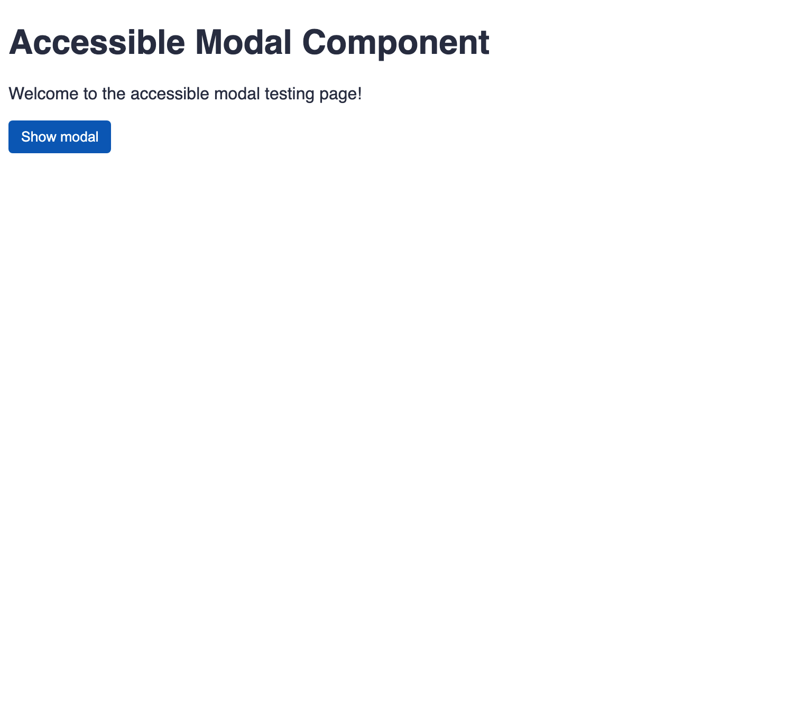
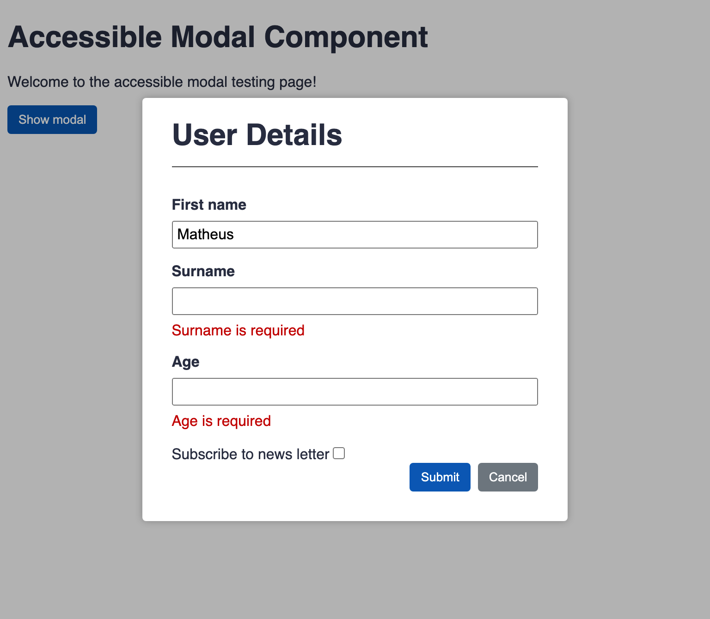

# A11y - P2 - Projeto de curso de Angular da Alura

Este é o projeto criado no curso [Angular: Avançando no design de componentes com acessibilidade](https://www.alura.com.br/curso-online-angular-avancando-componentes-acessibilidade), na plataforma de estudos da [Alura](https://www.alura.com.br/).

### Motivação

Buscando certificações e também aprimoramento dos estudos; evolução com o framework, focando em completar as formações dessa excelente plataforma de estudos da Alura.

Esse curso foi essencial para aprimorar os conhecimentos do framework Angular, além de regras para escrever um bom código visando a acessibilidade.

### Tópicos abordados

- Criar uma API modal do zero;
- Aplicar regras de acessibilidade da WCAG;
- Criar componentes dinamicamente;
- Entender como o Angular funciona por debaixo dos panos;
- Avançar no uso de diretivas;
- Criar animações com auxílio do módulo Animations.

### Execução do projeto

O projeto foi criado com o [Angular CLI](https://github.com/angular/angular-cli) versão 10.1.0.
Após o clone do repositório, executar os comandos:

```bash
# instalação das depêndencias
$ sudo npm install

# execução em modo de desenvolvimento
$ ng serve

# ou
$ npm start
```

### Screenshot



---



---

## Autor

- Website - [Matheus B. Grigoletto](https://matheusgrigoletto.com)
- [LinkedIn](https://www.linkedin.com/in/matheus-grigoletto/)
